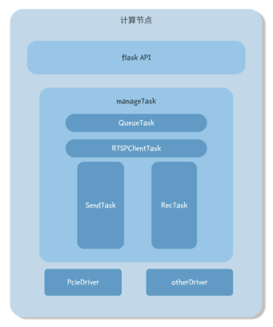

# infer_platform
一个模型推理加速平台。目前支持Hailo计算卡、RKNN、CPU。
## 运行
### 前提条件
 - 你需要一台RTSP视频流服务器
 - 你需要安装FFmpeg库。
 - 你需要安装对应modelsZoo中自己平台的库
 - 你需要将权重文件放入models文件夹中
### 使用方式
直接运行app.py文件即可
详细调用方式可以参考APIFoxUrl: [API Documentation](https://apifox.com/apidoc/shared-55aa7f92-ff27-4258-b624-f3a6f6c26eab)
### API接口
- **获取节点信息**: `/device/nodeInfo` (GET)
- **开启视频流任务**: `/device/startStream` (POST)
  - 参数: `modelFile`, `rtspUrl`, `waringUrl`, `resRtspUrl`
- **停止视频流任务**: `/device/stopStream` (GET)
- **下载模型文件**: `/device/downloadModel` (POST)
  - 参数: `hostname`, `port`, `username`, `password`, `remotePath`, `localFilename`
- **列出所有模型文件**: `/device/listModels` (GET)
- **删除指定模型文件**: `/device/deleteModel` (DELETE)
  - 参数: `filename`
## 架构图

## 使用注意事项
 - modelsZoo中存放的是不同类型的模型对应的推理代码。models存放的是模型对应的权重文件。
比如，如果我使用的是yolov5s的onnx库推理，这时需要在app.py文件中修改modelType的类型
为yolov5sOnnx。此时，代码运行时会自动导入yolov5sOnnx.py文件中的imgStreamInfer函数。
当运行推理时，系统会单独为imgStreamInfer函数起一个线程去运行推理内容。所以当我们需要
开发一个新的类型的模型时，我们需要新建一个这样的py文件在modelsZoo中，之后
编写一个imgStreamInfer函数来执行逻辑。
 - imgStreamInfer函数的定义时，需要model_path, rtsp_url, waring_url, res_rtsp_url, event
这几项参数，其中model_path参数你可以据此来载入这个模型的权重，rtsp_url用于
为你提供输入视频流的地址，waring_url用于触发你的报警信息后，你进行通知的地址。
res_rtsp_url为你渲染出推理结果后需要推送的地址，event用于通知你需要执行结束。
 - utils/RTSPPush.py文件中可以通过调整ffmpeg库的参数来修改返回结果的视频质量。
 - 详情可参考yolov5sOnnx.py文件
## 其他
对于视频流服务器可以尝试这个：
```shell
docker run --rm -it --network=host aler9/rtsp-simple-server
```
若没有视频流输入，可以利用ffmpeg推送本地mp4，例：
```shell
ffmpeg -re -stream_loop -1 -i test_yolo.mp4 -c copy -f rtsp rtsp://172.17.0.1:8554/test.mp3
```
若想仅是预览rtsp返回的url结果，可以通过一下代码预览：
```pycon
import cv2

cap = cv2.VideoCapture("rtsp://172.31.145.120:8554/test_res")
ret,frame = cap.read()
while ret:
    ret,frame = cap.read()
    cv2.imshow("frame",frame)
    if cv2.waitKey(25) & 0xFF == ord('q'):
        break
cv2.destroyAllWindows()
cap.release()

```
